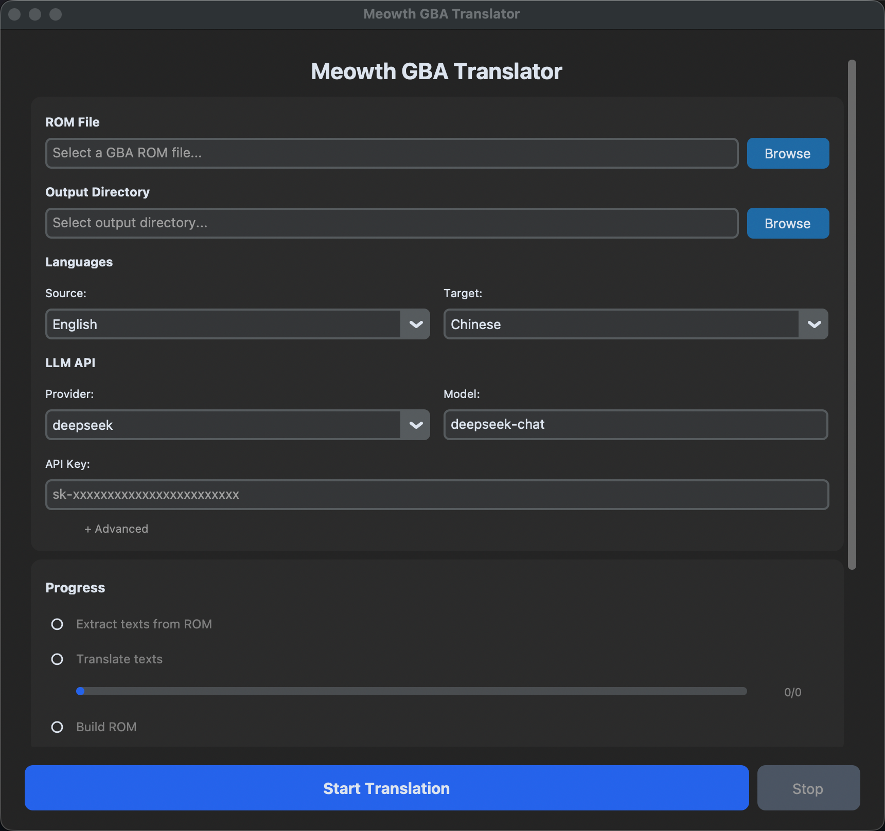
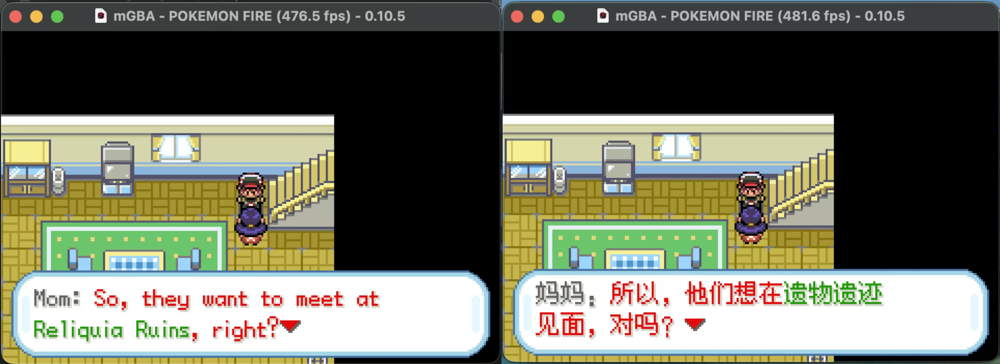

# Meowth Traducteur GBA

<div align="center">

[](LICENSE)
[](https://www.python.org)
[](https://github.com/Olcmyk/Meowth-GBA-Translator/releases)

**Langues** | [English](./README.md) | [中文](./README.zh.md) | [Deutsch](./README.de.md) | [Italiano](./README.it.md) | [Español](./README.es.md)

Un traducteur de ROM GBA Pokémon intelligent alimenté par LLM avec interfaces GUI et CLI

</div>

---

## Aperçu du Projet

**Meowth GBA Translator** est un outil complet conçu pour traduire les ROM Pokémon Game Boy Advance (GBA). Il combine l'extraction automatique de texte, la traduction intelligente alimentée par LLM et la fonctionnalité de construction de ROM pour simplifier considérablement le flux de travail de traduction.

### Caractéristiques Principales

- **Support d'Interface Dual**: GUI conviviale et CLI puissante
- **Traduction IA**: Support pour 11+ fournisseurs LLM (OpenAI, DeepSeek, Google Gemini, etc.)
- **Multiplateforme**: Support pour macOS, Windows, Linux
- **Support de Six Langues**: Anglais, espagnol, français, allemand, italien, chinois
- **Flux de Travail Efficace**: Extraire → Traduire → Construire en une commande
- **Complètement Gratuit**: 100% open source, licence MIT
- **Bibliothèque de Polices Intelligente**: Injection automatique de polices pour les traductions en chinois


## Installation

### Méthode 1: Application GUI (Recommandée pour la Plupart des Utilisateurs)

Téléchargez la dernière version:

- **macOS**: [Meowth-Translator-macOS.dmg](https://github.com/Olcmyk/Meowth-GBA-Translator/releases)
- **Windows**: [Meowth-Translator-Windows.zip](https://github.com/Olcmyk/Meowth-GBA-Translator/releases)

**Exigences Système**:
- macOS 10.13+ ou Windows 10+
- Aucune installation requise, exécutez directement après le téléchargement

### Méthode 2: Paquet Python (Pour les Développeurs/Utilisateurs CLI)

```bash
# Installer CLI uniquement
pip install meowth

# Ou installer avec support GUI
pip install meowth[gui]
```

**Exigences Système**:
- Python 3.10 ou supérieur
- Gestionnaire de paquets pip

### Méthode 3: Construire à partir de la Source

```bash
# Cloner le référentiel
git clone https://github.com/Olcmyk/Meowth-GBA-Translator.git
cd Meowth-GBA-Translator

# Créer un environnement virtuel
python3 -m venv venv
source venv/bin/activate  # Windows: venv\Scripts\activate

# Installer en mode développement
pip install -e ".[gui,dev]"

# Exécuter GUI
meowth-gui

# Ou utiliser CLI
meowth full pokemon.gba --provider deepseek
```

---

## Démarrage Rapide

### Utiliser GUI (Le Plus Facile)



1. Téléchargez et exécutez **Meowth Translator**
2. Cliquez sur "Sélectionner ROM" et choisissez votre ROM GBA Pokémon
3. Configurez les paramètres de traduction:
   - **Fournisseur LLM**: Sélectionnez le fournisseur LLM (OpenAI, DeepSeek, etc.)
   - **Langue Source**: Généralement "Anglais"
   - **Langue Cible**: Votre langue souhaitée
4. Cliquez sur "Démarrer la Traduction"
5. Attendez la fin (généralement 5-30 minutes selon la taille de la ROM)
6. Téléchargez la ROM traduite depuis le dossier de sortie


*Gauche: Jeu original | Droite: Jeu traduit*

### Utiliser CLI

#### Étape 1: Configurer la Clé API

Tout d'abord, définissez votre clé API comme variable d'environnement:

```bash
# DeepSeek (Recommandé)
export DEEPSEEK_API_KEY="sk-votre-clé"

# Ou d'autres fournisseurs
export OPENAI_API_KEY="sk-votre-clé"
export GOOGLE_API_KEY="votre-clé"
```

#### Étape 2: Exécuter la Traduction

```bash
# Exécuter le pipeline complet de traduction
meowth full pokemon_firered.gba \
  --provider deepseek \
  --source en \
  --target fr \
  --output-dir translated_roms

# La ROM traduite sera enregistrée dans: translated_roms/pokemon_firered_fr.gba
```

---

## Fournisseurs LLM Pris en Charge

| Fournisseur | Modèle Par Défaut | Clé API |
|-------------|------------------|---------|
| **DeepSeek** | deepseek-chat | `DEEPSEEK_API_KEY` |
| **OpenAI** | gpt-4o | `OPENAI_API_KEY` |
| **Google Gemini** | gemini-2.0-flash | `GOOGLE_API_KEY` |
| **Claude (Anthropic)** | claude-sonnet-4 | `ANTHROPIC_API_KEY` |
| **Groq** | llama-3.3-70b | `GROQ_API_KEY` |
| **Mistral** | mistral-large-latest | `MISTRAL_API_KEY` |
| **OpenRouter** | openai/gpt-4o | `OPENROUTER_API_KEY` |
| **SiliconFlow** | DeepSeek-V3 | `SILICONFLOW_API_KEY` |
| **Zhipu GLM** | glm-4-flash | `ZHIPU_API_KEY` |
| **Moonshot** | moonshot-v1-8k | `MOONSHOT_API_KEY` |
| **Qwen** | qwen-plus | `DASHSCOPE_API_KEY` |

**Recommandation**: Nous recommandons d'utiliser **DeepSeek** car il a été utilisé tout au long du développement et des tests. La traduction d'une ROM Pokémon GBA typique coûte environ 2 RMB (~0,28 USD) avec DeepSeek.

---

## Guide d'Utilisation

### Commandes CLI

#### 1. Pipeline Complet (Recommandé)

Complétez l'extraction, la traduction et la construction en une commande:

```bash
meowth full pokemon.gba \
  --provider deepseek \
  --source en \
  --target fr \
  --output-dir outputs
```

**Explication des Options**:
- `--provider`: Fournisseur LLM à utiliser
- `--source`: Code de langue source (par défaut: "en")
- `--target`: Code de langue cible (par défaut: "fr")
- `--output-dir`: Dossier de sortie (par défaut: "outputs")
- `--work-dir`: Dossier de travail temporaire (par défaut: "work")
- `--batch-size`: Textes par lot de traduction (par défaut: 30)
- `--workers`: Threads de traduction parallèles (par défaut: 10)
- `--api-base`: Adresse API personnalisée (pour les API compatibles OpenAI)
- `--api-key-env`: Nom de variable d'environnement pour la clé API
- `--model`: Nom de modèle personnalisé

#### 2. Pipeline Étape par Étape

Pour les utilisateurs avancés qui ont besoin de plus de contrôle:

```bash
# Étape 1: Extraire le texte de la ROM
meowth extract pokemon.gba -o texts.json

# Étape 2: Traduire le texte
export DEEPSEEK_API_KEY="sk-votre-clé"
meowth translate texts.json \
  --provider deepseek \
  --target fr \
  -o texts_translated.json

# Étape 3: Construire la ROM traduite
meowth build pokemon.gba \
  --translations texts_translated.json \
  -o pokemon_fr.gba
```

#### 3. Utiliser le Fichier de Configuration (meowth.toml)

Créez `meowth.toml` dans votre répertoire de travail:

```toml
[translation]
provider = "deepseek"
model = "deepseek-chat"
source_language = "en"
target_language = "fr"

[translation.api]
key_env = "DEEPSEEK_API_KEY"
base_url = "https://api.deepseek.com/v1"
```

Puis exécutez simplement:
```bash
export DEEPSEEK_API_KEY="sk-votre-clé"
meowth full pokemon.gba
```

### Fonctionnalités GUI

L'interface GUI fournit une interface conviviale avec:

- **Sélection de ROM**: Parcourez et sélectionnez votre ROM GBA Pokémon
- **Configuration du Fournisseur**: Configuration facile des clés API LLM
- **Paramètres de Traduction**: Configurez les langues source/cible et les paramètres de traduction
- **Suivi de la Progression**: Mises à jour de progression en temps réel avec journalisation détaillée
- **Gestion des Erreurs**: Messages d'erreur clairs et suggestions de correction
- **Gestion de la Sortie**: Organisez et gérez les ROMs traduites

---

## Langues Prises en Charge

Langues actuellement prises en charge:

- **Anglais** - `en`
- **Espagnol** - `es`
- **Français** - `fr`
- **Allemand** - `de`
- **Italien** - `it`
- **Chinois** - `zh-Hans`

**Important**: La traduction en chinois ne supporte que les ROMs avec correctifs binaires, pas les projets de décompilation. Les autres combinaisons de langues n'ont pas cette restriction.

## Configuration

### Variables d'Environnement

Définissez ces variables dans votre shell ou fichier `.env`:

```bash
# Clés API
export DEEPSEEK_API_KEY="sk-..."
export OPENAI_API_KEY="sk-..."
export GOOGLE_API_KEY="..."

# Optionnel: Adresse API personnalisée (pour les services compatibles OpenAI)
export CUSTOM_API_BASE="https://api.example.com/v1"
```

### Fichier de Configuration (meowth.toml)

```toml
[translation]
provider = "deepseek"              # Fournisseur LLM
model = "deepseek-chat"            # Nom du modèle
source_language = "en"             # Code de langue source
target_language = "fr"             # Code de langue cible
batch_size = 30                    # Textes par lot
max_workers = 10                   # Travailleurs parallèles

[translation.api]
key_env = "DEEPSEEK_API_KEY"       # Variable d'environnement pour la clé API
base_url = "https://api.deepseek.com/v1"  # URL du point de terminaison API
```


## Utilisation Avancée

### Utiliser des Modèles Personnalisés

Utilisez un modèle différent avec votre fournisseur:

```bash
# OpenAI avec GPT-4 Turbo
meowth full pokemon.gba \
  --provider openai \
  --model gpt-4-turbo \
  --target fr

# Version spécifique de DeepSeek
meowth full pokemon.gba \
  --provider deepseek \
  --model deepseek-chat \
  --target fr
```

### Utiliser des Points de Terminaison API Personnalisés

Pour les API compatibles OpenAI:

```bash
meowth full pokemon.gba \
  --provider openai \
  --api-base "https://api.yourservice.com/v1" \
  --api-key-env "YOUR_API_KEY" \
  --model "your-model" \
  --target fr
```

### Traduction par Lot

Traduisez plusieurs ROMs:

```bash
for rom in *.gba; do
  meowth full "$rom" \
    --provider deepseek \
    --target fr \
    --output-dir translated/
done
```

### Optimisation des Performances

Ajustez la taille du lot et le nombre de travailleurs pour des performances optimales:

```bash
# Plus rapide (plus agressif, coût plus élevé)
meowth full pokemon.gba \
  --provider deepseek \
  --batch-size 50 \
  --workers 20 \
  --target fr

# Plus lent (plus conservateur, coût plus faible)
meowth full pokemon.gba \
  --provider deepseek \
  --batch-size 10 \
  --workers 5 \
  --target fr
```


## Jeux Pris en Charge

Cet outil a été testé avec:

- Pokémon Gaia v3.2
- Pokémon SeaGlass v3.0
- Pokémon Rogue Ex v2.0.1a

D'autres jeux GBA Pokémon devraient également fonctionner, mais peuvent nécessiter des ajustements.


## Dépannage

### "Impossible de trouver MeowthBridge"
- **Cause**: Les fichiers de l'application sont corrompus ou installés de manière incomplète
- **Solution**: Réinstallez l'application ou reconstruisez à partir de la source

### "Clé API non trouvée"
- **Cause**: La variable d'environnement de clé API n'est pas définie
- **Solution**:
  ```bash
  export DEEPSEEK_API_KEY="sk-votre-clé-réelle"
  ```

### GUI ne se lance pas (macOS)
- **Cause**: Restrictions de sécurité macOS au premier lancement
- **Solution**:
  1. Allez à Paramètres Système → Confidentialité et Sécurité
  2. Trouvez le message concernant "Meowth Translator" étant bloqué
  3. Cliquez sur "Ouvrir quand même"

### "Extraction de ROM échouée"
- **Cause**: La ROM pourrait être corrompue ou dans un format non supporté
- **Solution**:
  1. Vérifiez que la ROM est un fichier GBA valide
  2. Pour les traductions en chinois, assurez-vous que la ROM ne provient pas d'un projet de décompilation
  3. Essayez d'abord avec une ROM connue

Pour plus d'aide, consultez [GitHub Issues](https://github.com/Olcmyk/Meowth-GBA-Translator/issues)

---

## Explication du Processus de Traduction

### Phase 1: Extraction (meowth extract)
- Scanne la ROM pour le texte traduisible
- Extrait les chaînes, dialogues, noms d'objets, etc.
- Sortie: `texts.json`
- Temps: ~30 secondes

### Phase 2: Traduction (meowth translate)
- Envoie les lots de texte au LLM
- Préserve les codes spéciaux et le formatage
- Applique les optimisations spécifiques à la langue
- Sortie: `texts_translated.json`
- Temps: 5-30 minutes (dépend de la taille de la ROM et de la vitesse du LLM)

### Phase 3: Construction (meowth build)
- Réinjecte le texte traduit dans la ROM
- Pour le chinois: Applique les correctifs de polices (requis)
- Crée la ROM traduite finale
- Sortie: `pokemon_fr.gba`
- Temps: ~1 minute

---

## Licence

Ce projet est sous licence MIT - consultez le fichier [LICENSE](LICENSE) pour plus de détails

---

## Crédits

Construit avec:

- [HexManiacAdvance](https://github.com/entropyus/HexManiacAdvance) - Extraction et injection de ROM
- [Pokemon_GBA_Font_Patch](https://github.com/Wokann/Pokemon_GBA_Font_Patch) - Correctif de police chinoise
- [customtkinter](https://github.com/TomSchimansky/CustomTkinter) - Framework GUI moderne
- [click](https://click.palletsprojects.com/) - Framework CLI
- [Fournisseurs LLM](https://openai.com/) - Traduction alimentée par IA

---

## Support

- Trouvé un bug? [Soumettez un Problème](https://github.com/Olcmyk/Meowth-GBA-Translator/issues)
- Vous avez une question? [Démarrez une Discussion](https://github.com/Olcmyk/Meowth-GBA-Translator/discussions)
- Vous aimez le projet? [Donnez-nous une Étoile sur GitHub](https://github.com/Olcmyk/Meowth-GBA-Translator)

---

## Contribution

Les contributions sont bienvenues! Domaines où vous pouvez aider:

- Ajouter le support de plus de langues
- Ajouter le support pour traduire les ROMs basées sur la décompilation en chinois
- Améliorer l'interface GUI/UX
- Écrire de la documentation

---

**Créé avec ❤️ pour la communauté de localisation Pokémon**
